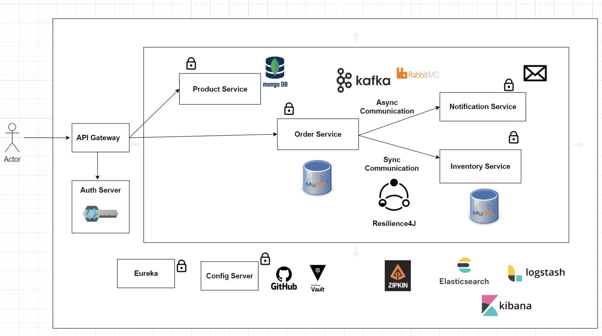
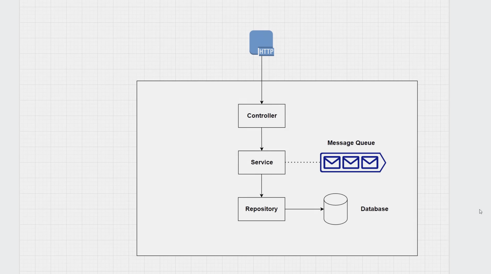

# Microservices Architecture Project Proposal

## Overview

This project aims to construct a scalable and efficient enterprise-level application using a Spring Boot-based microservices architecture. By leveraging Spring Cloud components, we will simplify the development of distributed systems and integrate advanced features such as asynchronous messaging, service discovery, configuration management, and performance monitoring.

## Architectural Components

- **API Gateway**: Serves as the unified entry point, handling request routing, load balancing, and authentication.
- **Auth Server**: Implements OAuth2 authentication to secure API access.
- **Product Service**: Manages product information, utilizing MongoDB for NoSQL storage.
- **Order Service**: Processes orders, with MySQL for order data storage.
- **Inventory Service**: Manages inventory status, also using MySQL for data storage.
- **Notification Service**: Asynchronously sends messages about order updates and inventory changes via Kafka or RabbitMQ.
- **Service Discovery**: Uses Eureka for service registration and discovery.
- **Config Server**: Manages centralized configuration, with GitHub and Vault for storing sensitive settings.
- **Tracing and Logging**: Integrates Zipkin for tracing and the ELK stack (Elasticsearch, Logstash, Kibana) for log analysis and visualization.

## Technology Stack

- **Spring Boot**: For creating microservices.
- **Spring Cloud**: For microservice communication, configuration management, and service discovery.
- **Kafka/RabbitMQ**: As messaging middleware for asynchronous communication.
- **MongoDB/MySQL**: For data persistence.
- **Eureka**: For service registration and discovery.
- **Spring Cloud Config**: For centralized configuration management.
- **OAuth2**: For authentication protocol.
- **Resilience4j**: For service fault tolerance.
- **Docker/Kubernetes**: For containerization and orchestration (not shown in the diagram, but recommended for deployment strategy).

## Security Strategy

- Utilize OAuth2 with JWTs to secure interactions between microservices.
- Encrypt sensitive configuration data using Vault.

## Monitoring and Logging

- Employ Zipkin for distributed tracing to diagnose latency issues.
- Utilize the ELK stack for log collection, storage, analysis, and visualization.

## Expected Outcomes

- A scalable, maintainable microservices ecosystem.
- Rapid response to market changes and business requirements.
- Increased system availability and fault tolerance.

## Timeline

- Project kickoff and requirement confirmation: Week 1.
- System design and planning: Weeks 2-3.
- Environment setup and basic service development: Weeks 4-6.
- Core service development and integration: Weeks 7-12.
- Testing, optimization, and documentation: Weeks 13-15.
- User Acceptance Testing (UAT) and deployment: Weeks 16-17.

## User Case 

- MVC

## Budget Estimate

[Detailed budget will be provided following further requirements analysis and resource planning.]
---

## Further development
- As for the subsequent adjustment towards a copyright book navigator for guiding the retrieval and use of books without providing the original text, this would require significant changes to the functionalities outlined in this proposal. 
- The focus would shift towards developing services for metadata handling, search indexing, and possibly integration with external book databases or APIs.